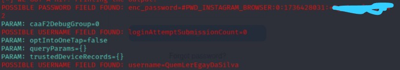

# Phishing para captura de senhas do Instagram
 Situação: Concluído! 

## Principais tecnologias utilizadas
````
Kali Linux - social-engineer-toolkit 
````
## Configurando o Phishing no Kali Linux
- Acesso root: sudo su
- Iniciando o setoolkit: setoolkit
- Tipo de ataque: Social-Engineering Attacks
- Vetor de ataque: Web Site Attack Vectors
- Método de ataque: Credential Harvester Attack Method 
- Método de ataque: Site Cloner
- Obtendo o endereço da máquina: ifconfig
- URL para clone: https://www.instagram.com

## Resutados
---
♦ Pagina clonada. 
<p align="center" >
     
</p>

♦ Captura de senha e username 
<p align="center" >
     
</p>
